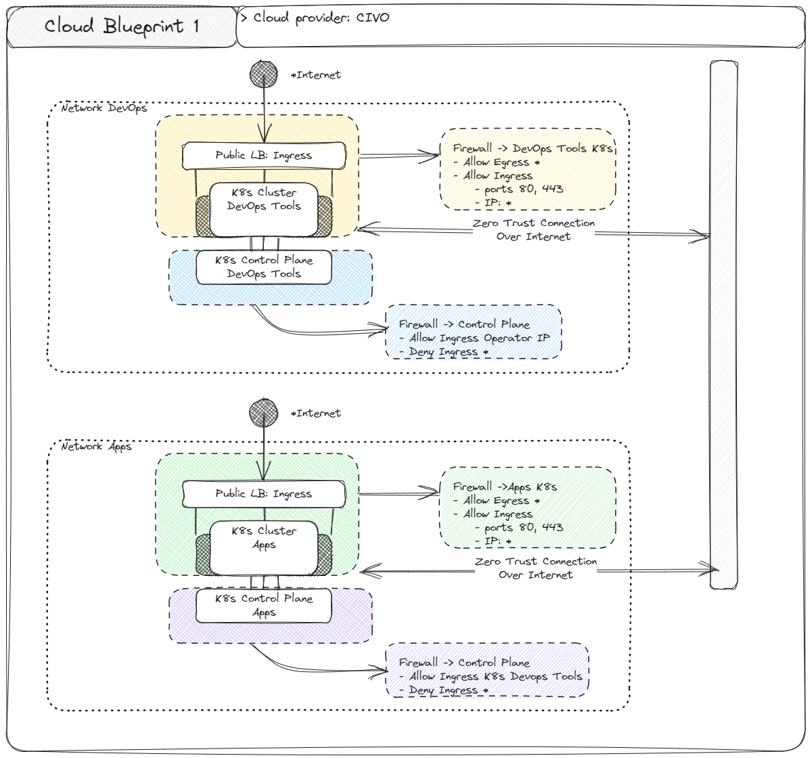

# The Startup Project

This is a demo project to show how to create an infrastructure at the CIVO Cloud using Terraform. And a small devops tooling to manage the infrastructure with and app deployment.

[TLTR](#TLTR)

## The Company:

This is a small startup with after some considerations, they saw their used case wasnt good fit for paas. So they decided to use IaaS. The company has a small team of developers and a small team of devops. The company has a small budget, so they need to use the best cost/benefit solution.

They want to have the entire infrastructure as code, and they want to use the GitOps methodology to manage the infrastructure. They want to have a CI/CD pipeline to deploy their apps. They want to have a SRE to monitor the infrastructure. They want to have a networking solution to manage the traffic between the apps and the internet. They want to have a solution to manage the access to the infrastructure.

And they want to have all of this with the smallest impact on the developer experience.

The company has are using the Github as their code repository. And they are using the Github Actions as their CI/CD pipeline.

After some discussions, the company decided to use the Civo Cloud as their cloud provider. Beccause is close to their user base, and is easy to forsee the costs.


## The Goals:

- Create the entire infrastructure using Terraform
- Enable the GitOps using ArgoCD
- Create the CI/CD pipelines using Github Actions
- Enable the SRE using Prometheus, Grafana, Loki, Alertmanager, Vitoriametrics, Promtail and Node Exporter
- Enable the networking using Nginx Ingress, Linkerd and Teleport
- Must be easy to the company developers to deploy their apps, and access the infrastructure
- The entire stack must be non vendor lock-in

## Considerations:

- Because the project is for a small startup, some non critical apps wont be deployed as HA
- This entire project is thinked to be managed by a single person.
- The project is thinked to be deployed in a single region.
- The project is thinked to be deployed in a single cloud provider.
- All the choices are made thinking in the simplicity and the cost.

## The project structure

The project is divided in two parts: the first one is the "Cloud" and the second one is the "DevOps" Tooling.

### The Cloud

The Civo cloud is a cloud provider focused in simplicity. And because of that some feature are out of the user reach. So we must use some workarounds to archive our goals.



The general idea here is:

- Network:
    - Devops
    - Apps
- Firewall:
    - Devops Tools K8s
    - Devops Tools Control Plane
    - Apps K8s
    - Apps Control Plane
- Static IP:
    - Devops LB
    - Apps LB
- Kubernetes:
    - Devops Tools
    - Apps

## The implementation

Because this is the first project, we'll create an object storage to store the terraform state.

Because the Civo has support to Terraform and allow us to retrive the kubeconfig, we can use the Terraform to create the entire infrastructure.

The project will have two parts: the first one is the terraform creations and the second one is the argocd creations.

Look at the [terraform](./terraform/) folder to see the code. And look at the [argocd](./k8s/main/) folder to see the code.

# TLTR

## Requirements:

- Terraform
- CIVO Cloud account
- Github account

## How to use:

- Setup the enviroment variables:

Variable | Where to find | Description
--- | --- | ---
TF_VAR_civo_api_key | The Civo Cloud API Key | The API Key to access the Civo Cloud
TF_BACKEND_CONFIG | The Terraform backend config | The Terraform backend config to store the state in the object storage must contain the `access_key` and the `secret_key`
TF_VAR_github_token | The Github Token | The Github Token to access read the Gitops repo repository and comment the PRs
TF_VAR_operator_ip | The Operator IP | The IP that will be allowed to access the infrastructure Eg: `x.x.x.x/32`

- Programs to install:

Program | Required | Where to find | Description
--- | --- | --- | ---
Terraform | Yes | [Terraform](https://www.terraform.io/downloads.html) | The Terraform binary
Kubectl | No | [Kubectl](https://kubernetes.io/docs/tasks/tools/) | The Kubectl binary
HELM | No | [HELM](https://helm.sh/docs/intro/install/) | The HELM binary
Teleport | No | [Teleport](https://goteleport.com/teleport/download/) | The Teleport binary

- Create the infrastructure:

```bash
make cloud_init
make cloud_plan
make cloud_apply
```

- To destroy the infrastructure:

```bash
make cloud_destroy
```

- To deploy the Devops Tooling:

```bash
make tooling_init
make tooling_plan
make tooling_apply
```

- To destroy the Devops Tooling:

```bash
make tooling_destroy
```
